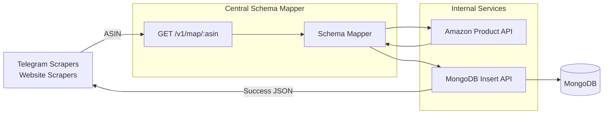

# Samanvaya | समन्वय | Centra Schema Mapper

## Purpose

Scrapers present on Telegram and web produce different schemized records which eventually breaks the Client component on Android, to fix it, Central Schema Mapper will sit between scrapers and DB. 

Scrapers will no longer insert records in DB, they'll just scrape the ASIN (in case of Amazon), and supply it to CSM.

CSM will then form a consistent schemized record to ensure data consistensy.

---

## Workflow

---

## Tech Stack used

| Technology                                                                                                        | Purpose                            |
| ----------------------------------------------------------------------------------------------------------------- | ---------------------------------- |
|     | REST API Framework                 |
|  | Core Programming Language          |
|                 | HTTP Client for Internal API Calls |
|              | Powered by Vercel                  |